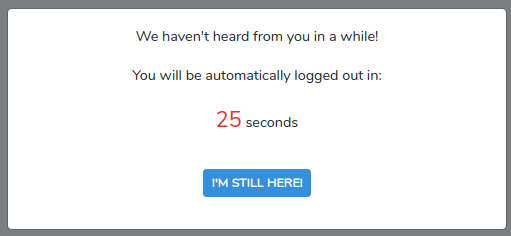

# Idle Timeout Alert
> A Laravel package for alerting idle sessions about to expire.

SESSION_LIFETIME is great but how is the user supposed to know when the session is about to expire due to inactivity, especially if it is a low value? Furthermore, a user may be actively engaging the site (by clicking around or filling out a form) without ever sending a request to the backend. Laravel may end the session during this time without the user knowing. 

When the session is about to expire, show a dialog so the user can choose not to be logged out.



## Installation

Laravel package and NPM dependencies
```sh
composer require vectorwyse/idle-timeout-alert
npm install --save idle-vue
```

## Usage

### Disable "Remember Me" functionality

Step 1:
Add the following line to `app/User.php`:
```php
protected $rememberTokenName = false;
```

Step 2:
Remove the "Remember Me" checkbox from your login form

### Publish and compile assets

Step 1: 
Publish assets to vendor folder:
```sh
php artisan vendor:publish --provider="Vectorwyse\IdleTimeoutAlert\IdleTimeoutAlertServiceProvider" --tag="vue-components"
```

Step 2: Add the following to your application's `resources/js/app.js`. Place within section where components are registered:
```js
require('./../assets/vendor/vectorwyse/idle-timeout-alert/js/app');
```

Step 3: Compile
```sh
npm run dev
```

### Add component

Finally, add the component to any page where you would like the dialog. A good place is `layouts/app.blade.php`.
```html
<timeout-dialog></timeout-dialog>
```

By default the dialog will only appear if the user happens to be idle when the session is about to expire. As long as user has activity, a ping will be sent in the background keeping the session alive.

If you would like to ignore user activity and have the dialog appear no matter what, then use the following:
```html
<timeout-dialog v-bind:ignore-activity="true"></timeout-dialog>
```

If you want to allow a user to be on a particular page forever without ever timing out, then use the following:
```html
<timeout-dialog v-bind:keep-alive="true"></timeout-dialog>
```
As long as user is on the page, a ping will be sent in the background keeping the session alive and no dialog will ever appear.

## Customization

Feel free to make changes to the dialog in `resources/assets/vendor/vectorwyse/idle-timeout-alert/js/components/TimeoutDialog.vue`. Don't forget to recompile assets afterward! 

## Support Us
[Vectorwyse](https://vectorwyse.com) is a digital agency offering advisory and web development services. We love building things with Laravel and Vue.js, so when we have an opportunity to give back to the community, we're super excited! 

If you find this package useful, or if you would like us to build something for you, feel free to [drop us a line!](mailto:hello@vectorwyse.com)
